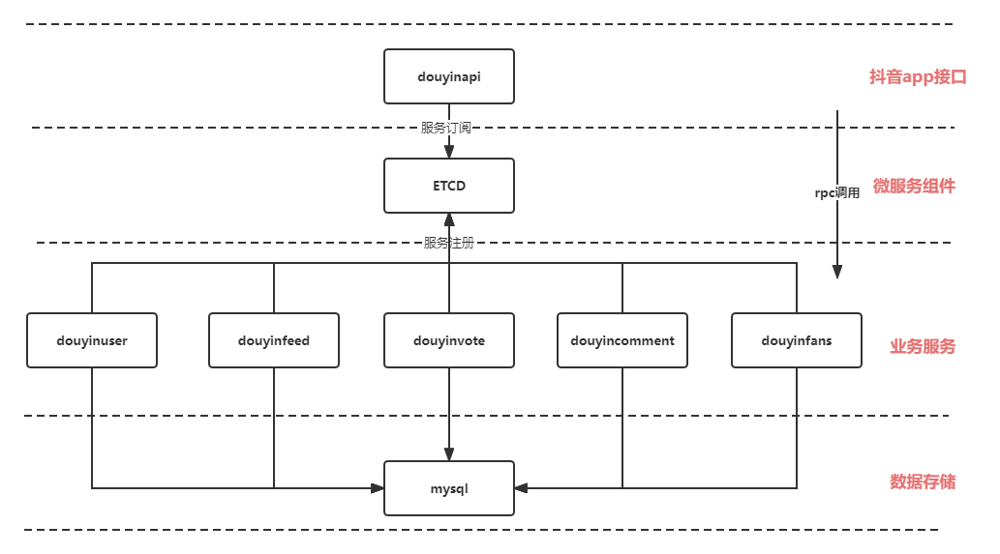

# simple-demo

# 抖音项目服务端

具体功能内容参考飞书说明文档


## 服务模块说明



暂时采用kitex作为微服务rpc框架，etcd作为注册中心，传输协议采用thrift，链路追踪基于opentracing。

| 服务名称           | 模块介绍           |      | 模块负责人  |
| ------------------ | ------------------ | ---- | ----------- |
| douyinapi          | 抖音api服务        |      | Optimum     |
| douyinuser         | 抖音用户数据管理   |      |             |
| douyinfeed         | 抖音视频流管理     |      |             |
| douyinvote         | 抖音点赞管理       |      |             |
| douyincomment      | 抖音评论管理       |      |             |
| ~~douyinrelation~~ | ~~抖音关系管理~~   |      |             |
| douyinfans         | 抖音关注与粉丝管理 |      | 嗷嗷哦润橘_ |
|                    |                    |      |             |

* 1.mysql数据库表设计，例如用户表，点赞表，评论表等，数据库文档说明
* 2.用户数据管理，包含**用户校验**、**用户注册**、**用户登录**等模块
* 3.视频流管理，包含视频流、视频列表（主页）、视频存储等模块
* 4.点赞管理，包含添加点赞、点赞数、点赞人列表等模块
* 5.评论管理，包含评论发布、评论查看、评论统计等模块
* 6.粉丝与关注，包含添加粉丝/关注，粉丝列表，粉丝数/关注数，关注列表等模块

## api接口设计
api接口监听并处理前端发来的http请求，抽取参数后调用rpc服务，收到rpc消息后，将消息体打包成json返回给前端。由于http请求的请求和相应参数已由前端给定，剩下rpc消息格式需要额外进行说明。
#### User模块
**注册**
request body:
* Username
* Password

Response body:
* user_id

**登录**


**用户信息**

#### Video模块


## 运行方式

工程无其他依赖，直接编译运行即可

```shell
go build && ./simple-demo
```

## 功能说明

接口功能不完善，仅作为示例

* 用户登录数据保存在内存中，单次运行过程中有效
* 视频上传后会保存到本地 public 目录中，访问时用 127.0.0.1:8080/static/video_name 即可

## 测试数据

测试数据写在 demo_data.go 中，用于列表接口的 mock 测试


