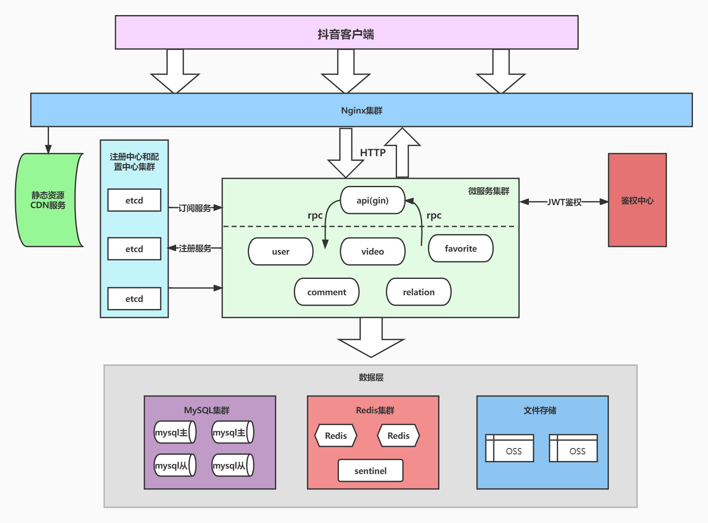

# simple-demo

# 抖音项目服务端

具体功能内容参考飞书说明文档

## 服务模块说明

项目介绍见[题目一：抖音项目【青训营】 - 飞书文档 (feishu.cn)](https://bytedance.feishu.cn/docx/doxcnbgkMy2J0Y3E6ihqrvtHXPg)，接口说明见[投稿接口 - 抖音极简版 (apifox.cn)](https://www.apifox.cn/apidoc/shared-8cc50618-0da6-4d5e-a398-76f3b8f766c5/api-18875092)



* 采用**kitex**作为微服务rpc框架
* 采用**etcd**进行服务发现和服务注册
* 采用**go-jwt**生成token进行用户验证
* 链路追踪基于**opentracing**
* 使用**docker-compose**管理容器

| 服务名称 | 模块介绍           |      | 模块负责人  | 模块内容                                 | 开发进度 |
| -------- | ------------------ | ---- | ----------- | ---------------------------------------- | -------- |
| api      | 抖音api服务        |      | Optimum     | **获取服务列表、相应前端http请求**       | 已完成   |
| user     | 抖音用户数据管理   |      | Optimum     | **用户校验**、**用户注册**、**用户登录** | 已完成   |
| video    | 抖音视频流管理     |      | Optimum     | **视频流、视频列表、视频上传**           | 已完成   |
| favorite | 抖音点赞管理       |      | FaMily。    | **点赞操作、点赞列表**                   | 开发中   |
| comment  | 抖音评论管理       |      | FaMily。    | **评论操作、评论列表**                   | 开发中   |
| relation | 抖音关注与粉丝管理 |      | 嗷嗷哦润橘_ | **关注操作、关注列表、粉丝列表**         | 开发中   |
|          |                    |      |             |                                          |          |

## 开发说明

开发时，可以参考以下流程完成各个模块

* 设计包含**请求、响应以及服务信息**的thrift-idl文件
* 编写**特定模块服务端代码，依次完成dao，service，handler部分的开发，用于和api服务的交互**
* 编写api服务端代码，封装rpc请求函数，在handler中基于gin处理解析http请求参数（**即从http request到rpc request**），并重新打包rpc响应内容（即从rpc response到http response）


## 运行方式

1. 运行基础依赖

```bash
docker-compose up
```

2. 运行api服务

```bash
cd cmd/api
sh run.sh
sh output/bootstrap.sh
```

3. 运行user服务

```bash
cd cmd/user
sh run.sh
sh output/bootstrap.sh
```

4. 运行video服务

```bash
cd cmd/video
sh video.sh
sh output/bootstrap.sh
```


## 功能说明

接口功能不完善，仅作为示例

* 用户登录数据保存在内存中，单次运行过程中有效
* 视频上传后会保存到本地 public 目录中，访问时用 127.0.0.1:8080/static/video_name 即可

## 测试数据

测试数据写在 demo_data.go 中，用于列表接口的 mock 测试

## 其他
* 本项目基于青训营Go笔记项目，相关资料可参考[青训营笔记服务项目概述](https://juejin.cn/post/7095977466094682148#heading-31)
* hyper-v和安卓模拟器冲突问题解决见：[Windows下hyper-v和安卓模拟器冲突问题](https://blog.csdn.net/weixin_42474261/article/details/125396451?spm=1001.2014.3001.5501)


